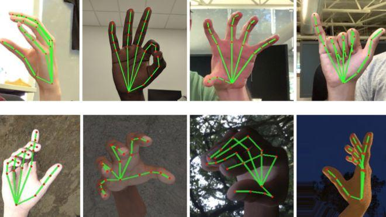

<h1 align="center">Voice-For-Everybody</h1>

<h4 align="center">An initiative to help the auditory disables Using AI and Machine Learning</h4>

## Inspiration
Since the outbreak of COVID-19, while the rest of the world have moved online, ASL speakers suffered (even more than before) making it difficult for so many of them to communicate. However, this has to come to an end. In the pursuit of finding accessibility, I created a tool to empower ASL speakers to speak freely with help of AI.

## What it does
Uses a webcam to translate ASL speech to text.
## How we built it
Used Mediapipe to generate points on hands, then use those points to get training data set. 
I used Jupyter Notebook to run OpenCV and Mediapipe. Upon running our data in Mediapipe, we were able to get a skeleton map of the body with 22 points for each hand. These points can be mapped in 3-dimension as it contains X, Y, and Z axis. We processed these features (22 points x 3) by saving them into a spreadsheet. Then we divided the spreadsheet into training and testing data.
Using the training set, we were able to create 6 Machine learning models:

- Gradient Boost Classifier
- XGBoost Classifier
- Support Vector Machine
- Logistic Regression
- Ridge Classifier
- Random Forest Classifier

## Challenges we ran into
Had to do solo work due to issues with the team
Time management
Project management
Data!!!! Lack of data!

## Accomplishments that we're proud of
Proud of pivoting my original idea and completing this epic hackathon. Also proud of making a useful tool

## What we learned
Time management
Project management

## What's next for Voice4Everyone
- More training of data - more classifications
- Phone app + Chrome Extension
- Reverse translation: Converting English Text to ASL
- Cleaner UI
- Add support for entire ASL dictionary and other sign languages
